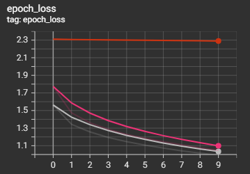

# Exercise 1

Training loss of the different models

Orange = SGD + LeakyReLU

Pink = Adam + LeakyReLU

Grey = Adam + tanh

| Model      | Test Accuracy |
| ----------- | ----------- |
| SGD  + LeakyReLU     | 13.9%       |
| Adam + LeakyReLU  | 62.6%        |
| Adam + tanh   | 64.0%        |
