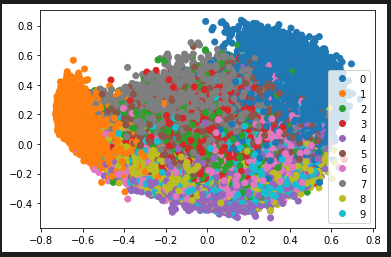
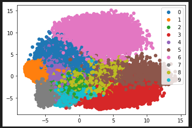

# Exercise 3
The biggest difference between PCA and t-SNE is that while PCA focuses on large pair-wise distances, t-SNE maintains the local structure.     
    
Regarding the difference between the untrained and trained model it varies between PCA and t-SNE. For PCA there is a big difference where the untrained model is very cluttered and not grouped by label. The trained PCA model had groups but was still cluttered as the groups were so close together. For t-SNE there wasn't as big of a difference between untrained and trained, mostly the groupings grew further apart from each other and the points got more accurate representations. 

## PCA - 1 Epoch

## t-SNE - 1 Epoch

## PCA - 10 Epochs

## t-SNE - 10 Epochs

