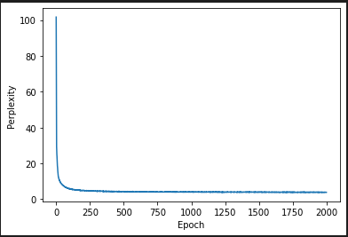
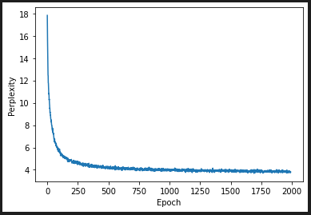
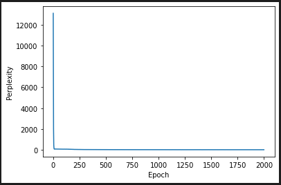
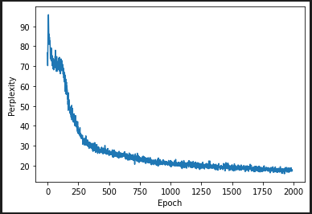

# Exercise 4

## Task 1

Plot of training perplexity

Same plot but without first 10 datapoints gives a (slightly) clearer view of change in perplexity

## Task 2

*====== Prime string: l	@_. ======*

    l	@_.

    DION:
    Most wife giwl that they are brought to:
    My life of Clais which does got bearing.

    KING HENR
*====== Prime string: S)_5: ======*

    S)_5:
    But in mon was a rock suddens so her patol.

    KING EDWARD IV:
    Since then; I for my lord, that both t
*====== Prime string: e-`.n ======*

    e-`.n ust forth graves,
    Is for unless I'll passing the most beggars for them.

    PETRUCHIO:
    No hands ready 

## Task 3

*====== Prime string: The ======*

    The rest, my lords of impeariness',

    Disposition.'

    FRIAR LAURENCE:

    Now, sir, or that that patience o' t

*====== Prime string: What if ======*

    What is her buse, good fair

    That hath not our vain advantage of something

    hand of king and closets my finge

*====== Prime string: Shall I give ======*

    Shall I give your lord;

    And tell him place that here will thelp, gentlemen,

    This comes out farther wild and mine

*====== Prime string: X087hNYB BHN BYFVuhsdbs ======*

    X087hNYB BHN BYFVuhsdbstart, lord impraced of my enemies.

    First Senator:

    What replainter'd of your word of me?

    CLIFFORD:
  
## Task 4

Plot of training perplexity

Same plot but without first 10 datapoints gives a clearer view of change in perplexity

====== Prime string: The ======

    ThemisuseinsurrectionmspinchedcontentiousmeteorscorsletthrongsstuckFreedcorsletfondnessdishesinterjoinrecordedtstherewithappeasert air have betwixt of a king on and?mile

    :WARWICK

     If a precious heedfully come of,this  
    I and thou ll as that Faith,more

     EDWARD kiss to from-with.comfort

====== Prime string: The ======

    Thesternboundresolvesingularityhillsamiabledishesrr  forth their people he into to and and rouse with and to my 'winter st to.children

     And of and my love no less here the
    hollow

    -open grasp take,reverend   come thee to;ministers

     which never of her visaged 

====== Prime string: The ======

    Thechannel,t   to,to   the woe of.sir

     KING RICHARD:VI

     The court will are the:she   your;sir

     KING O
    lord QUEEN
    follow Was to and not your spare:face   I ll go.mean
     My name for the;- I s

====== Prime string: . ======

    .bold

     Be you last Claudio withwould me the?grave

    ,I   that I this sir to of a man my,son

     O our banns to a happy,delighted

     And is you you hold that will,you   I be,Bianca

     Which the land him but

====== Prime string: . ======

    .e   Is thou ,Froth   your,king

      with ere of in of I.father

     'Draw am thee to such my,Wednesday

     If the
    admiral ,'A d the thee your more
    them And lives this blood to leashst:IV

     And make the be 

====== Prime string: . ======

    .

     KING RICHARD?:II

     '' ll seems drawn the thee them me the:return

     O good we have?holy

     And so thou.hear

     What nothing never for a king to
    thou I hath Graybeard in things is away you that me

====== Prime string: which is, ======

    which is,king

     Than I have it;of   from,noble  .royal

    :BENVOLIO

    ,I   the Lord thou in and,sir   and for my:sake   drown we'wrong:;nomination

     His :action   this sir my'CORIOLANUS ll:saddle

      fulfil you,severe

====== Prime string: which is, ======

    which is,this   and a words but a other.obedience

     Than to and the peace you them,it   to
    bloody my,house,   what more,heart   I hast,it   to
    that   like and my sting I his,down

     When that a soul of your power

====== Prime string: which is, ======

    which is,pleasure

     To further well do I
    ever And to the little say you be.world

    :ROMEO

     There can hast that my,prison   the
    thee I tis with,gown  ' ll see as
    thee In I ll do be,much

    ,Meantime   makes you that

====== Prime string: blah blah blah ======

This prime string crashes the model since the word "blah" is not present in the vocabulary generated from the Shakespeare data.

