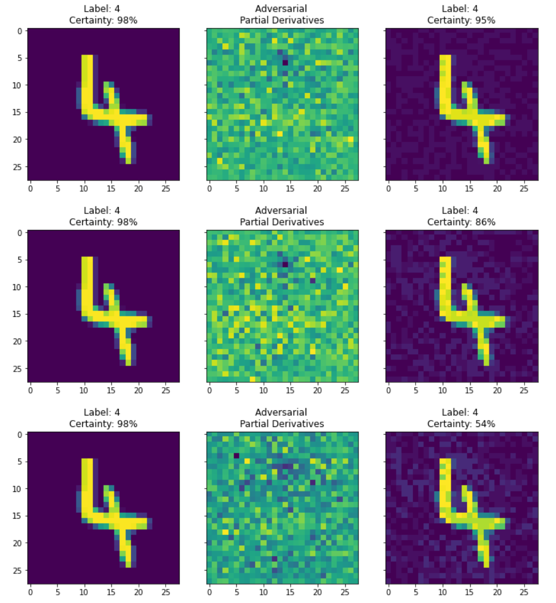

# Exercise 5

## Task 1: 

### Comparing the different loss functions
When comparing the results from both 20k iterations and 100k iterations between the original loss and the logistic loss they both seemed to perform the same.

20k iterations with original loss

100k iterations with original loss

20k iterations with logistic loss

100k iterations with logistic loss

### How can the results be improved?
1. Normalize the input [-1.+1]
2. Modified Loss function :min(log(1-D) to max(D)
3. Use Spherical Z rather than Uniform one - Sampling Generative Networks
4. Do not mix Real and Fake data by BatchNorm
5. Avoid Sparse Gradients (instead of ReLU use Leaky ReLU, and instead of Maxpool use Average Pool)
6. Label Smoothing
7. DCGANS/Hybrid models (KL + GAN, VAE+GAN)
8. Use RL stability tricks
9. Use ADAM
10. Track Failure early- check loss
11. Add noise to the inputs of the Discriminator (can also add noise to all the layers inside the Discriminator

## Task 1: 
### 2.1 Results

### 2.2 Results

### 2.3 Results

